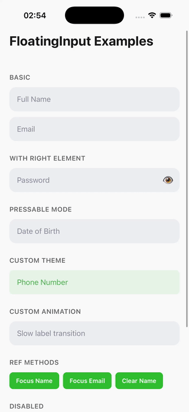

# rn-floating-input

A performant floating label TextInput for React Native with animated label transitions, error shake animation, and full customization support.

Built with `react-native-reanimated` for smooth 60fps animations. No other dependency — uses plain `StyleSheet`.

## Example

<p align="center">
  
</p>

## Installation

```bash
npm install rn-floating-input
# or
yarn add rn-floating-input
```

### Peer Dependencies

```bash
npm install react-native-reanimated react-native-worklets
```

Make sure `react-native-reanimated` is properly configured in your project (babel plugin, etc).

## Basic Usage

```tsx
import { FloatingInput } from 'rn-floating-input'

function MyForm() {
  const [value, setValue] = useState('')

  return (
    <FloatingInput
      label="Email"
      value={value}
      onChangeText={setValue}
    />
  )
}
```

## With Validation

```tsx
<FloatingInput
  label="Email"
  value={values.email}
  onChangeText={handleChange('email')}
  onBlur={handleBlur('email')}
  error={errors.email}
  touched={touched.email}
  keyboardType="email-address"
  autoCapitalize="none"
/>
```

When `touched` and `error` are both truthy, the error message renders below the input and a shake animation plays.

## With Right Element

```tsx
<FloatingInput
  label="Password"
  value={password}
  onChangeText={setPassword}
  secureTextEntry={!showPassword}
  right={
    <Pressable onPress={() => setShowPassword(!showPassword)}>
      <Icon name={showPassword ? 'eye-off' : 'eye'} />
    </Pressable>
  }
/>
```

## Pressable Mode

When `onPress` is provided, the input becomes a pressable area (useful for date pickers, dropdowns, etc):

```tsx
<FloatingInput
  label="Date of Birth"
  value={selectedDate}
  onPress={() => openDatePicker()}
/>
```

## Ref Methods

```tsx
const inputRef = useRef<FloatingInputRef>(null)

<FloatingInput ref={inputRef} label="Name" value={name} onChangeText={setName} />

// Later:
inputRef.current?.focus()
inputRef.current?.blur()
inputRef.current?.clear()
inputRef.current?.isFocused()
```

## Customization

### Theme Prop

Override default colors and sizes:

```tsx
<FloatingInput
  label="Name"
  value={name}
  onChangeText={setName}
  theme={{
    backgroundColor: '#F0F0F0',
    selectionColor: '#007AFF',
    borderRadius: 8,
    fontSize: 14,
    fontFamily: 'Inter-Regular',
  }}
/>
```


| Token                 | Default   | Description                        |
| --------------------- | --------- | ---------------------------------- |
| `backgroundColor`     | `#EDEFF2` | Input container background         |
| `labelColor`          | `#878A99` | Inactive label color               |
| `inputColor`          | `#36373D` | Text input color                   |
| `errorColor`          | `#E3152E` | Error label & message color        |
| `selectionColor`      | `#31BE30` | Cursor and selection color         |
| `placeholderColor`    | `#878A99` | Placeholder text color             |
| `borderRadius`        | `14`      | Container border radius            |
| `fontSize`            | `16`      | Input and inactive label font size |
| `labelActiveFontSize` | `12`      | Active (raised) label font size    |
| `fontFamily`          | `System`  | Font family for all text           |


### Styles Prop

Granular style overrides per element:

```tsx
<FloatingInput
  label="Name"
  value={name}
  onChangeText={setName}
  styles={{
    inputContainer: { borderWidth: 1, borderColor: '#DDD' },
    label: { fontWeight: '600' },
    input: { letterSpacing: 0.5 },
    error: { marginLeft: 16 },
    right: { right: 16 },
  }}
/>
```

### Animation Config

```tsx
<FloatingInput
  label="Name"
  value={name}
  onChangeText={setName}
  animationConfig={{
    labelDuration: 200,     // Label transition duration (ms)
    shakeMagnitude: 2,      // Error shake distance (px)
    shakeDuration: 50,      // Each shake step duration (ms)
  }}
/>
```

### Custom Input Renderer

Replace the default `TextInput` entirely:

```tsx
<FloatingInput
  label="Custom"
  value={value}
  onChangeText={setValue}
  renderInput={(props) => <MyCustomInput {...props} />}
/>
```

### TextInput Pass-through

Pass any additional `TextInput` props via `textInputProps`:

```tsx
<FloatingInput
  label="Bio"
  value={bio}
  onChangeText={setBio}
  textInputProps={{
    numberOfLines: 4,
    textAlignVertical: 'top',
  }}
/>
```

## Props


| Prop              | Type                           | Default     | Description                              |
| ----------------- | ------------------------------ | ----------- | ---------------------------------------- |
| `value`           | `string`                       | —           | Input value                              |
| `onChangeText`    | `(text: string) => void`       | —           | Change handler                           |
| `onBlur`          | `() => void`                   | —           | Blur handler                             |
| `onFocus`         | `() => void`                   | —           | Focus handler                            |
| `onPress`         | `() => void`                   | —           | Makes input pressable (disables editing) |
| `label`           | `string`                       | —           | Floating label text                      |
| `placeholder`     | `string`                       | —           | Shown when label is active               |
| `error`           | `string`                       | —           | Error message                            |
| `touched`         | `boolean`                      | —           | Whether field has been touched           |
| `maxLength`       | `number`                       | —           | Max input length                         |
| `keyboardType`    | `KeyboardTypeOptions`          | `'default'` | Keyboard type                            |
| `autoFocus`       | `boolean`                      | `false`     | Auto focus on mount                      |
| `editable`        | `boolean`                      | `true`      | Whether input is editable                |
| `autoCapitalize`  | `string`                       | —           | Auto-capitalization behavior             |
| `secureTextEntry` | `boolean`                      | `false`     | Password mode                            |
| `right`           | `ReactNode`                    | —           | Right slot element                       |
| `renderInput`     | `(props) => ReactNode`         | —           | Custom input renderer                    |
| `theme`           | `FloatingInputTheme`           | —           | Theme overrides                          |
| `styles`          | `FloatingInputStyles`          | —           | Per-element style overrides              |
| `style`           | `StyleProp<ViewStyle>`         | —           | Input container style shorthand          |
| `animationConfig` | `FloatingInputAnimationConfig` | —           | Animation overrides                      |
| `textInputProps`  | `TextInputProps`               | —           | Pass-through to underlying TextInput     |


## Exports

```tsx
// Component
import { FloatingInput } from 'rn-floating-input'

// Types
import type {
  FloatingInputProps,
  FloatingInputRef,
  FloatingInputTheme,
  FloatingInputStyles,
  FloatingInputAnimationConfig,
} from 'rn-floating-input'

```

## License

MIT
